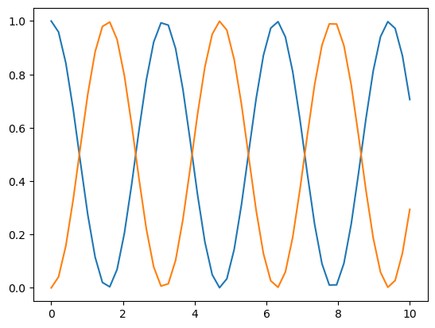

# Implementación de ejemplo

## Importamos módulos necesarios

Para utilizar estas funciones, necesitamos acceso a los tipos `np.array`, de
manera que los importamos junto con una librería para graficar los arreglos
finales. En este caso, se utilizará `matplotlib`.

```python
import numpy as np
import matplotlib.pyplot as plt
```
## Definimos las funciones a utilizar

```python
# Función que modela la evolución temporal (ver Referencia)
def dyn_generator(oper, state):
    return -1j * (np.dot(oper, state) - np.dot(state, oper))

# Función que implementa el método RK4 (ver Referencia)
def rk4(func, oper, state, h):
    k1 = h * func(oper, state)
    k2 = h * func(oper, state + k1 / 2)
    k3 = h * func(oper, state + k2 / 2)
    k4 = h * func(oper, state + k3)

    return state + (k1 + 2*k2 + 2*k3 + k4) * (1 / 6)
```

## Insumos

Definimos insumos, operador, estado inicial, arreglos y tamaño del paso.
También inicializamos arreglos para guardar los datos obtenidos.

```python
oOper = np.array([[0, 1], [1, 0]]) # Note que estos insumos son de tipo:
yInit = np.array([[1, 0], [0, 0]]) # np.array
times = np.linspace(0, 10, 50)
h = times[1] - times[0]

# Aquí guardaremos los estados obtenidos para graficarlos posteriormente
stateQuant00 = np.zeros(times.size)
stateQuant11 = np.zeros(times.size)
```

## Confeccionar arreglos

Vamos guardando los datos obtenidos de acuerdo al rango que le establecimos
anteriormente.

```python
for tt in range(times.size):
    # Guarde el valor de las entradas (0,0) y (1,1) en los arreglos que
    # definimos, btenga estos valores de las entradas de yInit
    stateQuant00[tt] = yInit[0, 0].real
    stateQuant11[tt] = yInit[1, 1].real

    # Invoque rk4 operando sobre yInit y devuelva el resultado al yInit, de esta
    # manera, en la siguiente iteración, el operador de esta iteración se
    # convierte en el inicial
    yInit = rk4(dyn_generator, oOper, yInit, h)
```

## Resultados

```python
plt.plot(times, stateQuant00)
plt.plot(times, stateQuant11)
```


